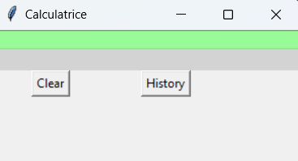

# Projet "**Calculatrice**"


## Version de python : 
- **3.10** ou **supérieure**

## Cloner le repository git
```bash
git clone https://github.com/Hysteresis/calculatrice.git
```
## Avant de commencer
- Créer un fichier "**calcul_history.csv**" dans le dossier racine sauf si ce fichier est déja créé 

## Comment se servir de l'application **Calculatrice** ?
- L'utilisateur saisit son calcul sur la première ligne
- L'utilisateur appuie sur la touche du clavier "Entrée"
- Le résultat du calcul s'affiche sur la deuxième ligne


## Description des boutons
- Bouton 'Clear' : efface l'affichage en cours



- Bouton 'History' : ouvre le menu déroulant contenant l'historique des calculs stocké dans le fichier
  "**calcul_history.csv**"
- Menu déroulant : affiche la liste de tous les calculs effectués

  
  

## Tester le fonctionnement
- Ouvrir le fichier de test "cahier_de_tests_calculatrice_Pierre.xlsx"
- Vérifier que les tests fonctionnent

  

## Ennoncé du formateur
  En utilisant **Tkinter**, votre mission sera de réaliser une **calculatrice**.
La contrainte à ce projet, est que la calculatrice ne possède qu’au **maximum trois boutons**
### Livrables attendus :

- Un lien Github vers l’application

- Une feuille comportant 10 tests fonctionnels de sa propre application

- Une feuille comportant 10 tests fonctionnels d’une application concurrente.

### Documentation Tkinter : 
https://docs.python.org/fr/3/library/tk.html

### Durée : 
7h

## Licence : 
Ce projet est sous licence MIT.

## Auteur : 
Pierre Marboutin

## Date de rendu
24/01/24
